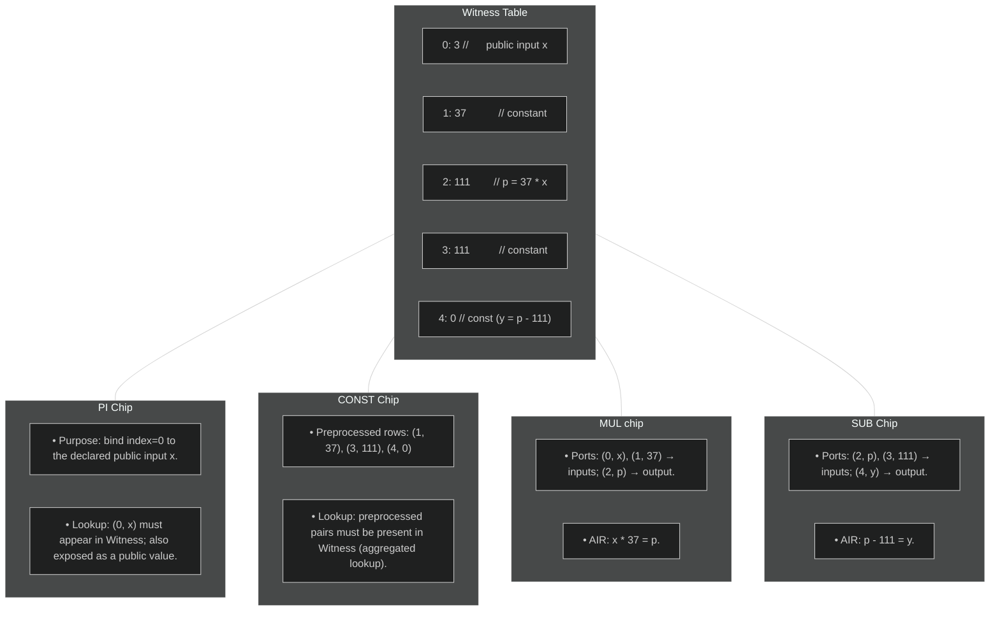

# Recursion Approach and Construction

## High-level architecture

Recursion in zero-knowledge proofs means using one proof to verify another: an (outer) prover will generate a proof 
to assert validity of an (inner) STARK proof. By applying this recursively, one obtains a (possibly compact) outer proof that attests to arbitrarily deep chains of computation.

Our approach to recursion for Plonky3 differs from a traditional zkVM approach: there is **no program counter, instruction set, or branching logic**. Instead, a fixed program is chosen, and the verifier circuit is specialized to this program only.

## Why fixing the program shape?

- **Performance**: without program counter logic, branching, or instruction decoding,
  the verifier’s constraints are much lighter.

- **Recursion efficiency**: since the shape of the trace is predetermined,
  the recursion circuit can be aggressively optimized.

- **Simplicity**: all inputs follow the same structural pattern, which keeps
  implementation complexity low.

## Limitations

- **Rigidity**: only the supported program(s) can be proven.

- **No variable-length traces**: input size must fit the circuit’s predefined structure.

- **Reusability**: adapting to a new program requires a new circuit.

The rest of this book explains how this approach is built, [how to soften its rigidity](extensions.md#strategies),
and why it provides a powerful foundation for recursive proof systems.

## Execution IR

An **Execution IR** (intermediate representation) is defined to describe the steps of the verifier.
This IR is *not proved itself*; it only guides trace population.
The actual soundness comes from the constraints inside the operation-specific STARK chips along with their lookups into the central witness table.

## Witness Table

The Witness table is a central bus that stores values shared across operations. It gathers the pairs `(index, value)` that will be accessed by 
the different chips via lookups to enforce consistency.

- The index column is *preprocessed*, or *preprocessed* [@@rap]: it is known to both prover and verifier in advance, requiring no online commitment.[^1]
- The Witness table values are represented as extension field elements directly (where base field elements are padded with 0 on higher coordinates) for addressing efficiency.

## Operation-specific STARK Chips

Each operation family (e.g. addition, multiplication, Merkle path verification, FRI folding) has its own chip.

A chip contains:

- Local columns for its variables.
- Lookup ports into the witness table.
- An AIR that enforces its semantics.

## Lookups

All chips interactions are performed via a lookup argument against the central Witness table. Enforcing multiset equality between chip ports and the Witness table entries ensures correctness without proving the execution order of the entire IR itself.

Below is a representation of the interactions between the main Witness table and the different chips.

[^1]: Preprocessed columns / polynomials can be reconstructed manually by the verifier, removing the need for a prover to commit to them and later perform the FRI protocol on them. However, the verifier needs $O(n)$ work when these columns are not structured, as it still needs to interpolate them. To alleviate this, the Plonky3 recursion stack performs *offline* commitment of unstructured preprocessed columns, so that we need only one instance of the FRI protocol to verify all preprocessed columns evaluations. 